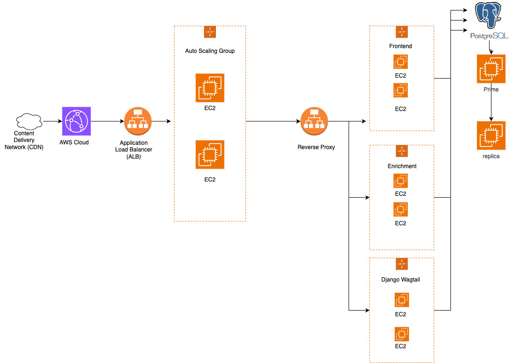

# **DS Infrastructure Web Documentation**


**⚠️ Note:** This document is regularly updated to reflect the changes. Please check for the latest version to ensure you have the most accurate information.

## **1. Overview**

The ds-infrastructure-web repository contains terraform configurations for migrating the **Etna** application from **Platform.sh** to **AWS**. This documentation provides a detailed guide on the architecture, deployment process, security practices, and recovery procedures.

## **2. Architecture**


 

 ## **3. Components**

 ***Frontend***

 * Hosted on EC2 instances in an Auto Scaling Group (ASG).
 * Accessed via an Application Load Balancer.
 * Uses AMI for deployment (web-frontend-primer*).
 * It serves user facing part of Etna application.

 ***Enrichment***

 * Hosted on EC2 instances in an ASG.
 * Uses AMI for deployment (web-enrichment-primer*).
 * The enrichment service is a backend component that processes and enhances data before it's delivered to users or other services.

 ***Cognito***

 * Manages user authentication and authorization.
 * Integrated with SES for email notifications.

 ***Lambda Functions***
 * Used for deployment and startup scripts.

 ***Elastic File System (EFS)***
 * Used for media storage.

 ***Reverse Proxy***
 * Hosted on EC2 instances in an ASG.
 * Uses AMI for deployment (web-rp-primer*).
 * Configured with NGINX for routing traffic.

 ***Security Groups***
 
 * Define network access rules for EC2 instances, ALBs and other resources.

 ***IAM***

 * It is responsible for defining AWS permissions and roles to ensure secure access control for your infrastructure.

 ***Cloud Front***

 * Cloud Front distribution acts as a secure CDN, caching content at edge locations and routing requests through AWS WAF before forwarding them to the reverse proxy ALB, using custom headers for origin authentication.

 ***Wagtail***

 * Wagtail refers to the **CMS(Content Management System)** component likely used to manage and serve content for Etna application.

 ***Route53***

 * Route53 is used for **DNS management** and **domain routing**, primarily to direct traffic to CloudFront distribution and other AWS services.   


## **4. Deployment Process**

***Prerequisites***

* AWS account with necessary permissions.
* Terraform installed locally.
* Access to the ds-infrastructure-web repository.

This project uses **GitHub Actions** for CI/CD automation. Github Actions helps in automating the deployment process by running workflows defined in `.github/workflows/` .

For more details on our CI/CD pipleine, check our [GitHub Actions Workflow](https://github.com/nationalarchives/ds-infrastructure-web/actions).

***Manual deployment Steps***

***1. Clone the repository***:

```bash
git clone https://github.com/nationalarchives/ds-infrastructure-web.git
cd ds-infrastructure-web
```

***2. Initialise Terraform***

```bash
terraform init
```

***3. Terraform Plan***
* Review the plan (additions, replacements and destroying of resources).


***Development Plan***
```bash
terraform plan \
  -var-file="../../vars/dev/terraform/autoscalinggroup.auto.tfvars" \
  -var-file="../../vars/dev/terraform/frontend.auto.tfvars" \
  -var-file="../../vars/dev/terraform/global.auto.tfvars" \
  -var-file="../../vars/dev/terraform/nginx-conf.auto.tfvars" \
  -var-file="../../vars/dev/terraform/reverse-proxy.auto.tfvars" \
  -var-file="../../vars/dev/terraform/waf.auto.tfvars" \
  -var-file="../../vars/dev/terraform/route53.auto.tfvars" \
  -var-file="../../vars/dev/terraform/media-efs.auto.tfvars" \
  -var-file="../../vars/dev/terraform/cloudfront.auto.tfvars" \
  -var-file="../../vars/dev/terraform/cognito.auto.tfvars" \
  -var-file="../../vars/dev/terraform/ses.auto.tfvars" \
  -var-file="../../vars/dev/terraform/wagtail.auto.tfvars" \
  -var-file="../../vars/dev/terraform/enrichment.auto.tfvars" \
  -var-file="../../vars/dev/terraform/redis.auto.tfvars"
  ```

***Staging plan***

```bash
terraform plan \
  -var-file="../../vars/staging/terraform/autoscalinggroup.auto.tfvars" \
  -var-file="../../vars/staging/terraform/frontend.auto.tfvars" \
  -var-file="../../vars/staging/terraform/global.auto.tfvars" \
  -var-file="../../vars/staging/terraform/nginx-conf.auto.tfvars" \
  -var-file="../../vars/staging/terraform/reverse-proxy.auto.tfvars" \
  -var-file="../../vars/staging/terraform/waf.auto.tfvars" \
  -var-file="../../vars/staging/terraform/route53.auto.tfvars" \
  -var-file="../../vars/staging/terraform/media-efs.auto.tfvars" \
  -var-file="../../vars/staging/terraform/cloudfront.auto.tfvars" \
  -var-file="../../vars/staging/terraform/enrichment.auto.tfvars" \
  -var-file="../../vars/staging/terraform/wagtail.auto.tfvars" \
  -var-file="../../vars/staging/terraform/cognito.auto.tfvars" \
  -var-file="../../vars/staging/terraform/ses.auto.tfvars"
  ```

  ***Live plan***

  ```bash
  terraform plan \
  -var-file="../../vars/live/terraform/autoscalinggroup.auto.tfvars" \
  -var-file="../../vars/live/terraform/frontend.auto.tfvars" \
  -var-file="../../vars/live/terraform/global.auto.tfvars" \
  -var-file="../../vars/live/terraform/nginx-conf.auto.tfvars" \
  -var-file="../../vars/live/terraform/reverse-proxy.auto.tfvars" \
  -var-file="../../vars/live/terraform/waf.auto.tfvars" \
  -var-file="../../vars/live/terraform/route53.auto.tfvars" \
  -var-file="../../vars/live/terraform/media-efs.auto.tfvars" \
  -var-file="../../vars/live/terraform/cloudfront.auto.tfvars" \
  -var-file="../../vars/live/terraform/enrichment.auto.tfvars" \
  -var-file="../../vars/live/terraform/wagtail.auto.tfvars" \
  -var-file="../../vars/live/terraform/cognito.auto.tfvars" \
  -var-file="../../vars/live/terraform/ses.auto.tfvars"
  ```

***4. Apply Configuration***

***Development apply***

```bash
terraform apply \
  -var-file="../../vars/dev/terraform/autoscalinggroup.auto.tfvars" \
  -var-file="../../vars/dev/terraform/frontend.auto.tfvars" \
  -var-file="../../vars/dev/terraform/global.auto.tfvars" \
  -var-file="../../vars/dev/terraform/nginx-conf.auto.tfvars" \
  -var-file="../../vars/dev/terraform/reverse-proxy.auto.tfvars" \
  -var-file="../../vars/dev/terraform/waf.auto.tfvars" \
  -var-file="../../vars/dev/terraform/route53.auto.tfvars" \
  -var-file="../../vars/dev/terraform/media-efs.auto.tfvars" \
  -var-file="../../vars/dev/terraform/cloudfront.auto.tfvars" \
  -var-file="../../vars/dev/terraform/cognito.auto.tfvars" \
  -var-file="../../vars/dev/terraform/ses.auto.tfvars" \
  -var-file="../../vars/dev/terraform/wagtail.auto.tfvars" \
  -var-file="../../vars/dev/terraform/enrichment.auto.tfvars"
  ```

  ***Staging apply***

  ```bash
  terraform apply \
  -var-file="../../vars/staging/terraform/autoscalinggroup.auto.tfvars" \
  -var-file="../../vars/staging/terraform/frontend.auto.tfvars" \
  -var-file="../../vars/staging/terraform/global.auto.tfvars" \
  -var-file="../../vars/staging/terraform/nginx-conf.auto.tfvars" \
  -var-file="../../vars/staging/terraform/reverse-proxy.auto.tfvars" \
  -var-file="../../vars/staging/terraform/waf.auto.tfvars" \
  -var-file="../../vars/staging/terraform/route53.auto.tfvars" \
  -var-file="../../vars/staging/terraform/media-efs.auto.tfvars" \
  -var-file="../../vars/staging/terraform/cloudfront.auto.tfvars" \
  -var-file="../../vars/staging/terraform/cognito.auto.tfvars" \
  -var-file="../../vars/staging/terraform/ses.auto.tfvars" \
  -var-file="../../vars/staging/terraform/wagtail.auto.tfvars" \
  -var-file="../../vars/staging/terraform/enrichment.auto.tfvars"
  ```

  ***Live apply***

  ```bash
  terraform apply \
  -var-file="../../vars/live/terraform/autoscalinggroup.auto.tfvars" \
  -var-file="../../vars/live/terraform/frontend.auto.tfvars" \
  -var-file="../../vars/live/terraform/global.auto.tfvars" \
  -var-file="../../vars/live/terraform/nginx-conf.auto.tfvars" \
  -var-file="../../vars/live/terraform/reverse-proxy.auto.tfvars" \
  -var-file="../../vars/live/terraform/waf.auto.tfvars" \
  -var-file="../../vars/live/terraform/route53.auto.tfvars" \
  -var-file="../../vars/live/terraform/media-efs.auto.tfvars" \
  -var-file="../../vars/live/terraform/cloudfront.auto.tfvars" \
  -var-file="../../vars/live/terraform/enrichment.auto.tfvars" \
  -var-file="../../vars/live/terraform/wagtail.auto.tfvars" \
  -var-file="../../vars/live/terraform/cognito.auto.tfvars" \
  -var-file="../../vars/live/terraform/ses.auto.tfvars"
  ```

  ***5. Verify Deployment***

  * Check AWS console for resources.

## **5. Terraform Configuration**

***File Structure***

* backend.tf: Configures the S3 bucket for terraform state.
* cognito.tf: Manages Cognito user pools and clients.
* data-ami.tf: Defines AMIs for EC2 instances.
* data.tf: Retrieves SSM Parameters and secrets.
* enrichment.tf: Configures the enrichment service.
* frontend.tf: Configures the frontend service.
* lambda.tf: Manages lambda functions and layers.
* media-efs.tf: Configures EFS and backups.
* iam.tf: Defines IAm roles and policies.
* provider.tf: Configures terraform providers (AWS and klayers).
* nginx-conf.tf: Configures nginx runtime configurations.
* reverse-proxy.tf: Configures the reverse proxy service.
* rp-nginx.tf: Configures nginx for the reverse proxy.
* security-groups.tf: Defines security groups for network access.
* wagtail.tf: Configures the wagtail CMS service.
* global-variables.tf: Defines global variables and tags used across all Terraform modules.
* waf.tf: Configures AWS WAF (Web Application Firewall) to protect web services from common exploits (SQL injection, XSS, DDoS).
* reverse-proxy.tf: Configures the NGINX reverse proxy service that routes and filters traffic between CloudFront and backend services (frontend, Wagtail, enrichment).

***Best Practices***
* Use modules for reusable components.
* Add comments and documentation to Terraform code.
* Validate Terraform configurations with ```terraform validate```.

## **6. Security Best Practices**

***IAM Roles and Policies***
* Follow the principle of least privilege.

***Secrets Management***
* Store secrets in AWS Secrets or Parameter store.
* Rotate secrets regularly.

***Network Security***
* Use security groups to restrict access to resources.
* Ensure public facing resources are properly secured.

## **7. Backup and Retention policies**

**EFS Backups**
* **Schedule**: Daily Backups.
* **Retention**: 30 days.
* **Cold storage**: After 7 days.
* **Deletion**: After 90 days.

**Terraform State**

* Enable versioning for the S3 bucket.
* Use state locking to prevent conflicts.

## **8. Troubleshooting**

**Common Issues**

1. **Terraform Apply fails**:
* Check for syntax errors in terraform files.
* Validate AWS permissions.
* Resources already existing.

2.**Lambda Function Fails**:
* Check CloudWatch logs for errors.
* Validate IAM permissions.

3.**EFS Backup fails**:
* Verify backup configuration in AWS Backup.
* Check IAM permissions for AWS Backup.